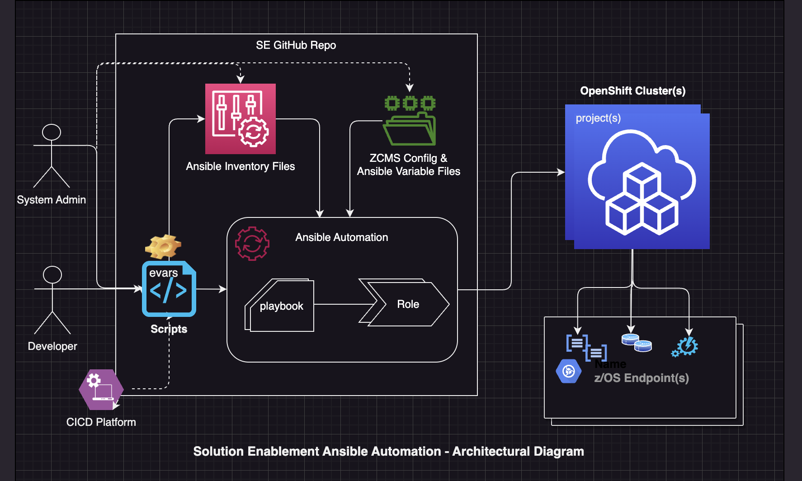

#
# Copyright 2023 IBM Inc. All rights reserved
# SPDX-License-Identifier: Apache2.0
#

# Solutions Enablement Ansible Automation (SEAA) framework for IBM Z and Cloud Modernization Stack

## Overview
 In this topic, we outline the [capabilities](/docs/guide/feature-list.md) and components of the SEAA framework. The framework provides a prescriptive model based on tags and configuration variables provided. These values determine how automation interacts with the underlying systems and a user. The framework offers the following components as outlined in the table below.

|**Components**|**Description**|
|----------------------|---------------|
|Ansible [variables](../../ibm/seaa/ansible/variables/README.md)|Default and variable data used to define Red Hat® OpenShift® and z/OS system resources|
|Ansible [inventory](../../ibm/seaa/ansible/playbooks/inventory/README.md)|To define multiple host and host variables used to deploy resources on OpenShift and z/OS endpoints.
|Ansible [playbooks](../../ibm/seaa/ansible/playbooks/README.md), [tasks](../../ibm/seaa/ansible/tasks/README.md), [roles](../../ibm/seaa/ansible/roles/README.md), [run_playbook scripts](../../ibm/seaa/scripts/run_playbooks/README.md)|To deploy stack components
|Admin shell [scripts](../../ibm/seaa/scripts/admin/README.md) |To run administer stack resources on OpenShift cluster and z/OS endpoints. 

See the [configuration](../../ibm/seaa/ansible/variables/config/seaa_config.yaml) variables used to control how automation runs along with [tags](../guide/seaa-tags.md) used for the specific [playbook](../../ibm/seaa/ansible/playbooks/README.md) being run.

## Framework Architectural Diagram

---
---
## Minimum Requirements
Listed below are the minimum requirements for OpenShift and z/OS endpoints.
<!-- -<!-- - - Dev Environment:
- ansible-lint -  python -m pip install ansible-lint -->

**Openshift Cluster - v4.9 or later**
- OpenShift cluster with [IBM Z and Cloud Modernization Stack](https://www.ibm.com/docs/en/cloud-paks/z-modernization-stack/latest?topic=installing) entitlement keys for the following certified operators installed:
  - z/OS Cloud Broker 

**z/OS endpoint** <!--  (when running z/OS [admin scripts/playbooks](ansible/scripts/admin)) ** Work in Progress  -->
- See z/OS storage [requirements](https://www.ibm.com/docs/en/cloud-paks/z-modernization-stack/2023.1?topic=planning-system-requirements#z-os-storage)
- [Python 3.8](https://www.python.org/downloads/) or later - for connecting and running ansible playbooks on zos endpoints
- [ZOAU 1.1.0](https://www.ibm.com/docs/en/wdfrhcw/1.4.0?topic=components-z-open-automation-utilities) or later -  for scripts that require ZOAU commands  

---
## Next steps [getting started workstation](../setup/get-started-workstation.md) -or- [getting started CI/CD](../setup/get-started-cicd.md) 
