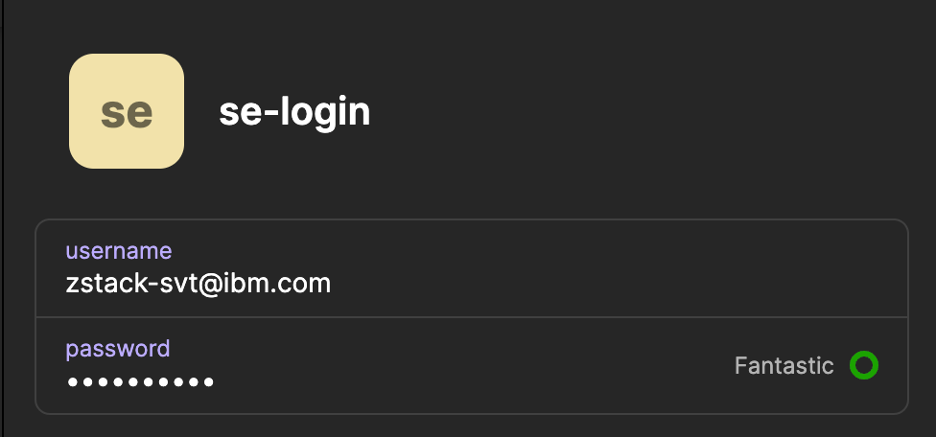
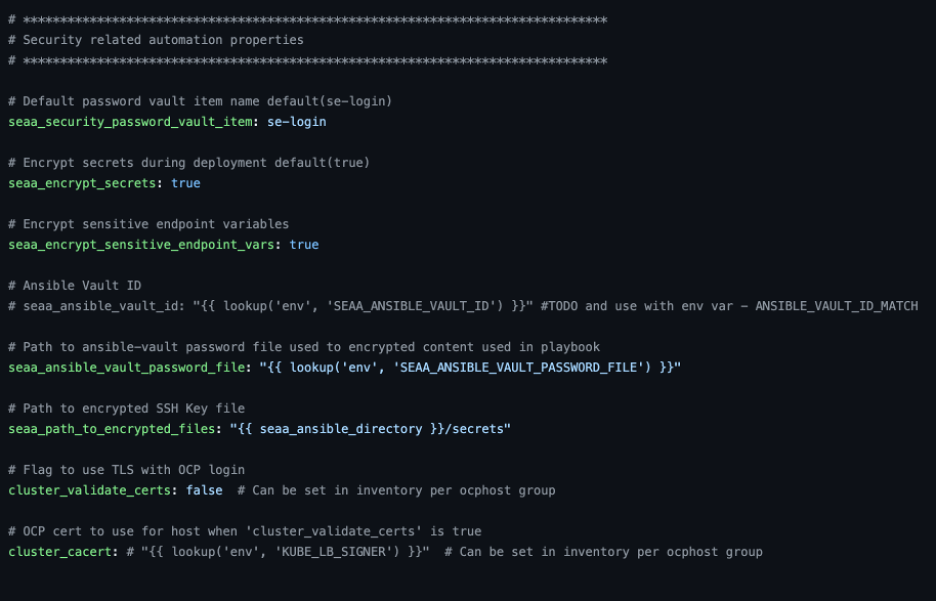

# Use 1Password Integration to Authenticate with OpenShift Cluster

- Pre-reqs:
  - OpenShift Cluster Login Account with access to API server
  - 1Password App and CLI installed

- Enable 1Password [Integration](https://developer.1password.com/docs/cli/get-started/#requirements), biometrics (optional)
  
- Add login item to 1Password vault with OpenShift login Credentials.
  - Default item name for SEAA framework is 'se-login' see image below:
    

- Update `seaa_security_password_vault_item` variable in the [seaa_config](../../ibm/seaa/ansible/variables/config/seaa_config.yaml) file with the item with 1Password item defined above. If using the default item name 'se-login' no change is required.
- 
  